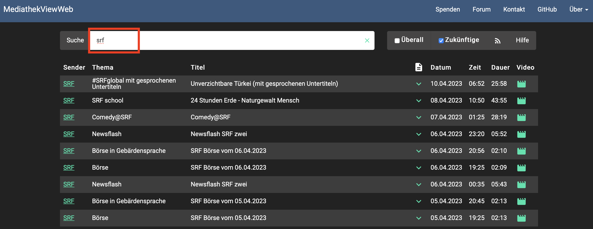
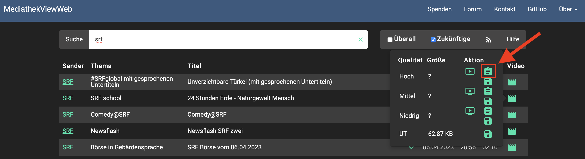

# Download Helper Mediathek View Web

Helper to download SRF videos with the help of MediathekViewWeb.

## How it works

It uses MediathekViewWeb to download the index-file (`m3u8` playlist file). Than uses curl to
download all segments of the video file. After that it get's concatenated by `ffmpeg` to a 
single video file.

Afterwards it deletes all intermediate files (index, segments, etc.).

## How to use

The basic syntax is `./download-srf-videos.sh "[index-url-from-mediathek]" "[final-video-name]"`

### 1. Get URL From MediathekViewWeb

Open `www.mediathekviewweb.de` and search for `srf` videos.

Get the URL of the index file of the video you want to download.

### 2. Use Script To Download

`./download-srf-videos.sh "https://srf-vod-amd.akamaized.net/ch/hls/myschool/2023/04/myschool_20230405_002054_18307622_v_webcast_h264_,q40,q10,q20,q30,q50,q60,.mp4.csmil/index-f6-v1-a1.m3u8" "some-video"`

### 3. Done

After the script finished your video is ready.

